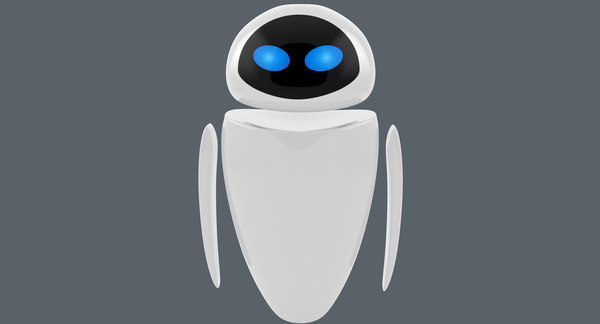

# Robot Friend

Favourite book information Management system made possible with hyperlinks and frames

---

## Table of content

- [Demo](#Demo)
- [Screenshot of the project](#Screenshot-of-the-project)
- [Technologies](#Technologies)
- [What's unique in this Project](#whats-unique-in-this-project)
- [EVE Fictional character](#EVE-Fictional-character)
- [Contributors](#Contributors)

---

## Demo

---

## Screenshot of the project

---

## Technologies

&nbsp;

&nbsp;

&nbsp;

---

## What's unique in this Project

- The robot-friend EVE is created using basic HTML5, CSS3 and animations.
- The shapes of the robot are coded using border-radius property from CSS3.
- The positioning of the body parts like head, inner-head, eyes, arms and torso are made possible with the help of <em>Flexbox</em>
- So, hover over our robot-friend EVE to experience the animation effect.

---

## EVE Fictional character

- EVE (which stands for Extraterrestrial Vegetation Evaluator) is the deuteragonist in the 2008 Disney/Pixar animated feature film WALL-E.
- Wikipedia

---

## Contributors

- T Aswin Barath <https://github.com/AswinBarath>

---