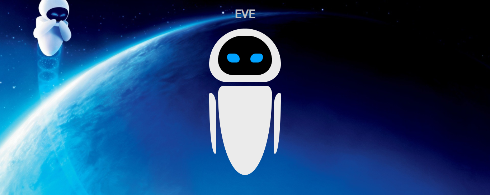

# robot-friend

### EVE
#### Fictional character

EVE (which stands for Extraterrestrial Vegetation Evaluator) is the deuteragonist in the 2008 Disney/Pixar animated feature film WALL-E.
---

 

### Screenshot of the project

- The robot-friend EVE is created using basic HTML5, CSS3 and animations.
- The shapes of the robot are coded using border-radius property from CSS3.
- The positioning of the body parts like head, inner-head, eyes, arms and torso are made possible with the help of <em>Flexbox</em>

- So, hover over our robot-friend EVE to experience the animation effect.